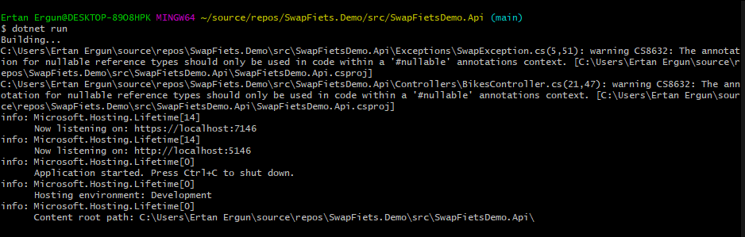
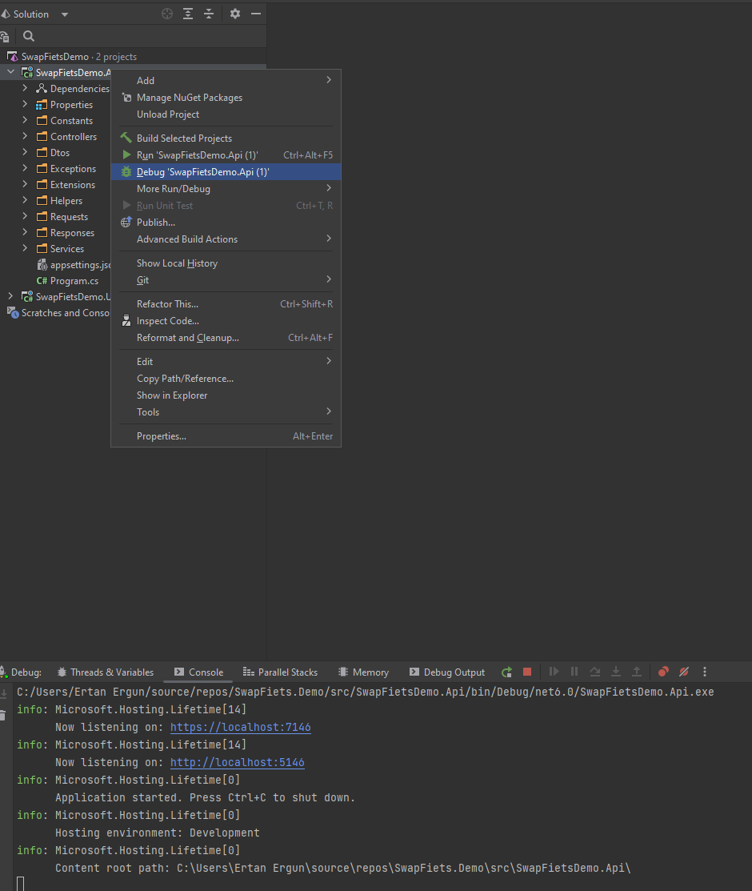
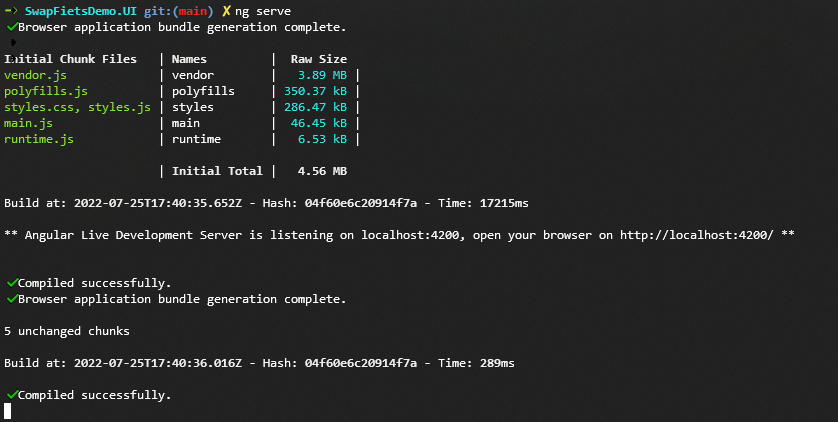
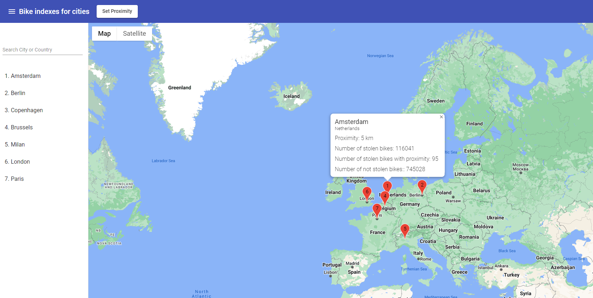

# SwapFiets Tech Challange

The repository consist of three main project;
1. ***SwapFietsDemo.Api*** is the main web api that gets the request from frontend and returns response based on the business logic. It is written in ASP.NET Core.
2. ***SwapFietsDemo.UI*** is the frontend application that gets the user input and communicates with web api. It is written in Angular.
3. ***SwapFietsDemo.UnitTests*** is the unit test project that tests the business logic.

## Configure your environment

In order the run the projects, you need both net core 6 and angular are being installed in your environment. You can follow the link below for setup;
1. Please visit [official website](https://dotnet.microsoft.com/en-us/download/dotnet/6.0) to download net core 6 sdk and follow [instructions](https://docs.microsoft.com/en-us/dotnet/core/tools/dotnet-run) to run net core project.
2. Please follow the guides to install andgular on [Windows](https://ccbill.com/kb/install-angular-on-windows) or [mac](https://www.knowledgehut.com/blog/web-development/install-angular-on-macos)

## Run applications
If you have an IDE to run .Net core applications, you can start the application in DEBUG mode or use `` dotnet run `` command to run the web api application.

or

After installing angular, you can go to the *SwapFietsDemo.UI* directory and run following commands to start the frontend application;
- `` npm install ``
- `` ng serve ``

## Use application
After running all necessary components, you can go to `` http://localhost:4200 `` on your web browser and start using the application

you can change the proximity with set proximity button located on top left. The default proximity is 5 km. 